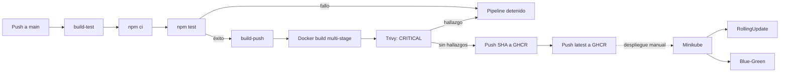
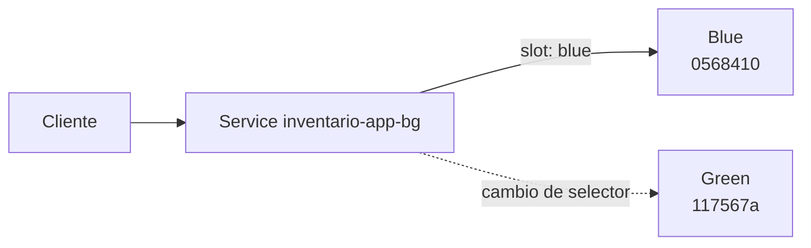

# 📦 Inventario App — Pipeline CI/CD con Docker y Kubernetes

[](https://github.com/AlexChuquipoma/inventario-app/actions)


<p align="center">
  
</p>

**Materia:** Sistemas Distribuidos<br>
**Integrantes:** Alexander Chuquipoma · Jean Pierre Valarezo<br>
**Repositorio:** [github.com/AlexChuquipoma/inventario-app](https://github.com/AlexChuquipoma/inventario-app)

---

## Índice

- [Descripción](#descripción)
- [Objetivos técnicos](#objetivos-técnicos)
- [Tecnologías utilizadas](#tecnologías-utilizadas)
- [Arquitectura y flujo CI/CD](#arquitectura-y-flujo-cicd)
- [Estructura del proyecto](#estructura-del-proyecto)
- [Cumplimiento de la práctica](#cumplimiento-de-la-práctica)
- [Requisitos previos](#requisitos-previos)
- [Ejecución local](#ejecución-local)
- [Docker multi-stage](#docker-multi-stage)
- [CI/CD con GitHub Actions](#cicd-con-github-actions)
- [Escaneo de seguridad con Trivy](#escaneo-de-seguridad-con-trivy)
- [Kubernetes base](#kubernetes-base)
- [RollingUpdate](#rollingupdate)
- [Persistencia y recreación de pods](#persistencia-y-recreación-de-pods)
- [Estrategia Blue-Green](#estrategia-blue-green)
- [Arranque lento y probes](#arranque-lento-y-probes)
- [Kubernetes Secret](#kubernetes-secret)
- [Evidencias](#evidencias)
- [Problemas reales encontrados](#problemas-reales-encontrados)
- [Métricas DORA propias](#métricas-dora-propias)
- [Resultados finales](#resultados-finales)
- [Endpoints y variables de entorno](#endpoints-y-variables-de-entorno)
- [Entregables](#entregables)

---

## Descripción

`inventario-app` es una aplicación Node.js y Express que administra un catálogo
de productos mediante una interfaz web y una API REST. Los datos se almacenan
localmente en un archivo JSON.

El objetivo del proyecto no fue únicamente desarrollar la aplicación: se
construyó un laboratorio reproducible de integración y entrega continua para
probar el recorrido completo de un cambio:

```text
Código → pruebas → imagen Docker → escaneo de seguridad → GHCR
       → despliegue manual en Minikube → RollingUpdate / Blue-Green
```

GitHub Actions automatiza la instalación, las pruebas, la construcción, el
escaneo y la publicación de la imagen. El despliegue en Minikube se realiza
manualmente con `kubectl`, porque el runner alojado de GitHub no tiene acceso al
clúster local del estudiante.

La interfaz permite listar, crear y eliminar productos. La API también permite
consultar y actualizar productos individualmente. El endpoint `/version`
expone la versión, el color y el hostname del pod, lo que facilita comprobar
qué réplica o ambiente atendió una solicitud.

## Objetivos técnicos

- Implementar un pipeline **fail-fast** que detenga la publicación si fallan
  las pruebas o el escaneo de seguridad.
- Construir una imagen Docker multi-stage reproducible y ejecutar la
  aplicación como usuario no privilegiado.
- Publicar imágenes inmutables en GHCR con el SHA completo del commit y una
  etiqueta `latest`.
- Desplegar dos réplicas en Kubernetes con RollingUpdate, recursos, contexto de
  seguridad y probes HTTP.
- Demostrar actualización, recuperación, pérdida de datos efímeros y cambio de
  tráfico Blue-Green.
- Separar una credencial `API_KEY` del código mediante un Kubernetes Secret.
- Medir lead time, frecuencia de despliegue y change failure rate con datos
  reales de Git y Kubernetes.

## Tecnologías utilizadas

| Tecnología | Uso real en el proyecto |
|---|---|
| Node.js 24 | Runtime de la aplicación y ejecución de pruebas con `node --test`. |
| Express 4.22.2 | Servidor HTTP, API REST y publicación de archivos estáticos; versión resuelta en `package-lock.json` para el rango `^4.19.2`. |
| JSON local | Persistencia educativa mediante `data/products.json`. |
| npm | Instalación determinista con `npm ci`, pruebas y poda de dependencias. |
| Git | Historial, hashes inmutables y timestamps usados en las métricas DORA. |
| Docker | Construcción multi-stage y empaquetado reproducible. |
| GitHub Actions | Jobs `build-test` y `build-push` encadenados. |
| GHCR | Registro de imágenes con etiquetas SHA y `latest`. |
| Trivy | Gate de vulnerabilidades `CRITICAL` antes de cualquier `docker push`. |
| Kubernetes | Deployment, Service, probes, Secret, RollingUpdate y Blue-Green. |
| Minikube | Clúster Kubernetes local utilizado para las demostraciones. |
| PowerShell | Ejecución y automatización de las pruebas locales en Windows. |

## Arquitectura y flujo CI/CD



La dependencia explícita `needs: build-test` impide iniciar `build-push` si el
job de pruebas no finaliza correctamente. Dentro de `build-push`, Trivy se
ejecuta después del build y antes de publicar cualquiera de las dos etiquetas.

## Estructura del proyecto

Árbol real del repositorio, omitiendo `node_modules/`:

```text
inventario-app/
├── .github/
│   └── workflows/
│       └── ci-cd.yml
├── data/
│   └── .gitkeep
├── docs/
│   └── informe-reflexion.md
├── k8s/
│   ├── blue-green/
│   │   ├── patches/
│   │   │   ├── service-blue.yaml
│   │   │   └── service-green.yaml
│   │   ├── deployment-blue.yaml
│   │   ├── deployment-green.yaml
│   │   └── service.yaml
│   ├── deployment.yaml
│   └── service.yaml
├── output/
│   ├── pdf/
│   │   └── informe-reflexion-cicd.pdf
│   └── word/
│       └── Informe-Tecnico-Completo-Inventario-CICD.docx
├── public/
│   ├── app.js
│   ├── index.html
│   └── styles.css
├── .dockerignore
├── .gitattributes
├── .gitignore
├── Dockerfile
├── README.md
├── db.js
├── package-lock.json
├── package.json
├── server.js
└── server.test.js
```

`data/products.json` se crea durante la ejecución y está ignorado por Git. Los
archivos `k8s/secret.yaml` y `k8s/secret.local.yaml` también están ignorados
para reducir el riesgo de versionar una credencial.

## Cumplimiento de la práctica

| Requisito | Implementación comprobable | Estado |
|---|---|:---:|
| Docker multi-stage | Etapas `build` y `runtime` en `Dockerfile`. | ✅ |
| `npm test` dentro del build | `RUN npm test` detiene la construcción si falla una prueba. | ✅ |
| Pipeline fail-fast | `build-push` depende de `build-test` mediante `needs`. | ✅ |
| GHCR con SHA y `latest` | Se construyen y publican ambas etiquetas. | ✅ |
| Kubernetes con mínimo 2 réplicas | `replicas: 2` en el Deployment base y en Blue/Green. | ✅ |
| RollingUpdate | `maxUnavailable: 1` y `maxSurge: 1`. | ✅ |
| Readiness y liveness | Ambas consultan `/health`. | ✅ |
| Blue-Green | Dos Deployments y un Service con selector `slot`. | ✅ |
| Métricas DORA | Lead time, frecuencia y CFR calculados con datos propios. | ✅ |
| **Adicional 1: Secret** | `API_KEY` se inyecta mediante `secretKeyRef`. | ✅ |
| **Adicional 2: Trivy** | Bloquea vulnerabilidades `CRITICAL` antes del push. | ✅ |
| **Adicional 3: arranque lento** | `STARTUP_DELAY_SECONDS`, `startupProbe` y secuencia `503 → 200`. | ✅ |

Se implementaron los **tres componentes adicionales**. La práctica requería
dos; el tercer componente constituye el trabajo adicional demostrado.

## Requisitos previos

- Node.js 24.
- npm incluido con Node.js para el entorno de desarrollo.
- Git.
- Docker Desktop.
- `kubectl`.
- Minikube.
- PowerShell para reproducir exactamente los comandos documentados en Windows.

Comprobación rápida:

```powershell
node --version
npm.cmd --version
git --version
docker version
kubectl version --client
minikube version
```

## Ejecución local

Instalar exactamente las dependencias registradas en `package-lock.json`:

```powershell
npm.cmd ci
```

Ejecutar las siete pruebas:

```powershell
npm.cmd test
```

Iniciar la aplicación:

```powershell
npm.cmd start
```

Abrir [http://localhost:3000](http://localhost:3000) o comprobar las rutas:

```powershell
curl.exe -i http://localhost:3000/
curl.exe -i http://localhost:3000/health
curl.exe -i http://localhost:3000/version
curl.exe -i http://localhost:3000/api/products
```

## Docker multi-stage

El `Dockerfile` contiene dos etapas:

1. **`build`**: copia `package.json` y `package-lock.json`, ejecuta `npm ci`,
   incorpora el código, ejecuta `npm test` y elimina dependencias de desarrollo
   mediante `npm prune --omit=dev`.
2. **`runtime`**: recibe solo la aplicación y sus dependencias de producción.
   Elimina npm/npx, declara `USER node` y ejecuta `node server.js`.

Esta separación reduce la superficie de ataque y evita distribuir herramientas
que no son necesarias para servir la aplicación.

Construir:

```powershell
docker build -t inventario-app:local .
```

El paso `RUN npm test` forma parte de la construcción. Si una prueba falla,
Docker no produce la imagen final.

Ejecutar:

```powershell
docker run --rm --name inventario-local -p 3000:3000 -e APP_VERSION=v1-docker -e APP_COLOR=blue inventario-app:local
```

Verificar desde otra terminal:

```powershell
curl.exe -i http://localhost:3000/
curl.exe -i http://localhost:3000/health
curl.exe -i http://localhost:3000/version
curl.exe -i http://localhost:3000/api/products
docker exec inventario-local id
```

La comprobación de identidad produjo `uid=1000(node) gid=1000(node)`.

## CI/CD con GitHub Actions

El workflow [`.github/workflows/ci-cd.yml`](.github/workflows/ci-cd.yml) se
ejecuta con cada `push` a `main` y también admite `workflow_dispatch`.

```text
build-test
    │
    └── éxito ──► build-push
```

### Job `build-test`

1. Descarga el repositorio.
2. Configura Node.js 24 y caché de npm.
3. Ejecuta `npm ci`.
4. Ejecuta `npm test`.

### Job `build-push`

La relación fail-fast está declarada en el workflow:

```yaml
build-push:
  needs: build-test
```

Después:

1. Inicia sesión en GHCR mediante `GITHUB_TOKEN`.
2. Construye y carga la imagen en el runner.
3. Ejecuta Trivy con severidad `CRITICAL` y `exit-code: "1"`.
4. Publica la etiqueta con el SHA completo.
5. Publica `latest`.

Formato de las imágenes:

```text
ghcr.io/alexchuquipoma/inventario-app:<commit-sha>
ghcr.io/alexchuquipoma/inventario-app:latest
```

Comprobar la imagen pública:

```powershell
docker pull ghcr.io/alexchuquipoma/inventario-app:latest
```

> El workflow termina en GHCR. La promoción a Minikube se realizó manualmente
> con `kubectl`, lo que evita afirmar un despliegue automático que no existe.

## Escaneo de seguridad con Trivy

Trivy funciona como gate de seguridad dentro de `build-push`:

```text
Docker build → Trivy → push SHA → push latest
```

La Action está fijada al SHA completo correspondiente a `trivy-action` v0.36.0:

```text
aquasecurity/trivy-action@ed142fd0673e97e23eac54620cfb913e5ce36c25
```

Su configuración revisa paquetes del sistema operativo y librerías, no ignora
hallazgos corregibles y devuelve código `1` cuando encuentra severidad
`CRITICAL`.

### Incidente real y corrección

El primer escaneo devolvió código `1` y detectó un único hallazgo crítico:

| Dato | Resultado |
|---|---|
| Vulnerabilidad | `CVE-2026-59873` |
| Paquete | `tar` |
| Versión instalada | `7.5.15` |
| Versión corregida | `7.5.19` |
| Origen | Dependencia transitiva del npm global de la imagen runtime |

La aplicación no necesita npm ni npx durante la ejecución. Por ello se
mantuvieron en la etapa `build`, donde se utilizan `npm ci`, `npm test` y
`npm prune`, y se eliminaron de `runtime`:

```dockerfile
RUN rm -rf /usr/local/lib/node_modules/npm \
    && rm -f /usr/local/bin/npm /usr/local/bin/npx
```

Después de reconstruir, el mismo criterio terminó con código `0`, sin
vulnerabilidades `CRITICAL`, y la aplicación continuó respondiendo
correctamente.

Reproducir localmente con Trivy v0.70.0:

```powershell
docker run --rm aquasec/trivy:0.70.0 image --scanners vuln --pkg-types os,library --severity CRITICAL --exit-code 1 ghcr.io/alexchuquipoma/inventario-app:latest
Write-Output "trivy_exit_code=$LASTEXITCODE"
```

## Kubernetes base

Los manifiestos [`k8s/deployment.yaml`](k8s/deployment.yaml) y
[`k8s/service.yaml`](k8s/service.yaml) definen:

- dos réplicas;
- estrategia RollingUpdate;
- `maxUnavailable: 1` y `maxSurge: 1`;
- Service `ClusterIP` en el puerto 80, dirigido al puerto nombrado `http`;
- `startupProbe`, `readinessProbe` y `livenessProbe` sobre `/health`;
- requests de `50m` CPU y `64Mi` de memoria;
- límites de `250m` CPU y `256Mi` de memoria;
- ejecución non-root con UID/GID `1000`;
- `allowPrivilegeEscalation: false`;
- eliminación de todas las Linux capabilities;
- perfil seccomp `RuntimeDefault`;
- `API_KEY` obtenida desde un Secret.

### Preparar el clúster

```powershell
minikube start --driver=docker
kubectl cluster-info
kubectl get nodes
```

Como el Deployment referencia un Secret, este debe existir antes de aplicarlo:

```powershell
$apiKeyLocal = "api-$(New-Guid)"
kubectl create secret generic inventario-app-secret --from-literal="API_KEY=$apiKeyLocal" --dry-run=client -o yaml | kubectl apply -f -
Remove-Variable apiKeyLocal
```

Validar y aplicar:

```powershell
kubectl apply --dry-run=client -f .\k8s\
kubectl apply -f .\k8s\
kubectl rollout status deployment/inventario-app --timeout=120s
kubectl get deployment inventario-app
kubectl get pods -l 'app=inventario-app,!slot' -o wide
kubectl get service inventario-app
```

Acceder al Service:

```powershell
kubectl port-forward service/inventario-app 8080:80
```

Desde una segunda terminal:

```powershell
curl.exe -i http://localhost:8080/
curl.exe -i http://localhost:8080/health
curl.exe -i http://localhost:8080/version
curl.exe -i http://localhost:8080/api/products
```

## RollingUpdate

La demostración principal actualizó el Deployment base desde la imagen
`05684102ac7b3af3293560e7df628ded99b1ff03` hacia
`117567a11a86c3bf5d9b3ae75a05be96a190a0ff`.

Se utilizó el comando real:

```powershell
kubectl annotate deployment inventario-app kubernetes.io/change-cause="Deploy image 117567a" --overwrite
kubectl set image deployment/inventario-app inventario-app=ghcr.io/alexchuquipoma/inventario-app:117567a11a86c3bf5d9b3ae75a05be96a190a0ff
kubectl rollout status deployment/inventario-app --timeout=120s
kubectl get pods -l 'app=inventario-app,!slot' -w
kubectl rollout history deployment/inventario-app
```

La observación con `-w` mostró pods nuevos en `Pending`, `ContainerCreating`,
`Running` y finalmente `Ready`, mientras los antiguos terminaban. El Deployment
recuperó el estado `2/2` sin retirar simultáneamente todas las réplicas.

Las promociones posteriores desplegaron los commits `1077675`, `99d4de3` y
`30fb843`. El manifiesto actual fija la imagen final:

```text
ghcr.io/alexchuquipoma/inventario-app:30fb84399923c94dc42aefabb91350eddf16d0f0
```

## Persistencia y recreación de pods

Cada réplica escribe en su propio `data/products.json`, dentro de la capa
escribible y efímera del contenedor. No existe un volumen compartido ni una
base de datos externa.

Para evitar seleccionar pods Blue-Green se utiliza el selector:

```text
app=inventario-app,!slot
```

Experimento reproducido:

```powershell
$podOriginal = kubectl get pods -l 'app=inventario-app,!slot' -o jsonpath="{.items[0].metadata.name}"
Write-Output "pod_original=$podOriginal"
kubectl port-forward "pod/$podOriginal" 8081:3000
```

Con el port-forward activo se creó `POD-001` desde la interfaz en
`http://localhost:8081`. Después de detener el port-forward:

```powershell
kubectl delete pod $podOriginal
kubectl get pods -l 'app=inventario-app,!slot' -w
```

Kubernetes creó un pod nuevo y recuperó las dos réplicas disponibles. Al
consultar el reemplazo, solo aparecieron los tres productos semilla: `POD-001`
había desaparecido.

**Conclusión:** Kubernetes recuperó disponibilidad, pero no persistencia. Para
un entorno real se requiere una base de datos externa o una estrategia de
almacenamiento compatible con varias réplicas.

## Estrategia Blue-Green

Se eligió Blue-Green porque `/version` devuelve `version`, `color` y
`hostname`. Esto permite validar Green de manera determinista antes del cambio
de tráfico y confirmar posteriormente qué ambiente atendió la solicitud.



Un Canary habría hecho la demostración más probabilística: sería necesario
realizar varias solicitudes para observar el reparto y la base JSON local de
cada pod podría producir resultados diferentes. Blue-Green conserva dos
ambientes completos, pero permite un corte y rollback inmediatos.

### Desplegar Blue y Green

```powershell
kubectl apply --dry-run=client -f .\k8s\blue-green\
kubectl apply -f .\k8s\blue-green\
kubectl rollout status deployment/inventario-app-blue --timeout=120s
kubectl rollout status deployment/inventario-app-green --timeout=120s
kubectl get deployments -l app=inventario-app
kubectl get pods -l app=inventario-app -L slot
```

### Comprobar Green antes de exponerlo

```powershell
kubectl port-forward deployment/inventario-app-green 8083:3000
curl.exe -i http://localhost:8083/health
curl.exe -s http://localhost:8083/version
```

El resultado esperado identifica `version: green-117567a` y `color: green`.

### Comprobar Blue activo

El Service se crea inicialmente con `slot: blue`:

```powershell
kubectl get service inventario-app-bg -o jsonpath="{.spec.selector}"
kubectl get endpointslices -l kubernetes.io/service-name=inventario-app-bg
kubectl port-forward service/inventario-app-bg 8082:80
curl.exe -s http://localhost:8082/version
```

### Cambiar Blue → Green

Detener el port-forward anterior y ejecutar:

```powershell
kubectl patch service inventario-app-bg --type merge --patch-file .\k8s\blue-green\patches\service-green.yaml
kubectl get service inventario-app-bg -o jsonpath="{.spec.selector}"
kubectl get endpointslices -l kubernetes.io/service-name=inventario-app-bg
kubectl port-forward service/inventario-app-bg 8082:80
curl.exe -s http://localhost:8082/version
```

### Rollback a Blue

```powershell
kubectl patch service inventario-app-bg --type merge --patch-file .\k8s\blue-green\patches\service-blue.yaml
kubectl get service inventario-app-bg -o jsonpath="{.spec.selector}"
```

### Restaurar Green

```powershell
kubectl patch service inventario-app-bg --type merge --patch-file .\k8s\blue-green\patches\service-green.yaml
kubectl get service inventario-app-bg -o jsonpath="{.spec.selector}"
```

El port-forward se reinició después de cada cambio porque una sesión existente
puede permanecer conectada al pod seleccionado al iniciarse. Dentro del
clúster, el Service actualiza sus EndpointSlices al modificar el selector.

## Arranque lento y probes

`STARTUP_DELAY_SECONDS` simula una aplicación que ya acepta conexiones, pero
continúa inicializando dependencias. Mientras no termina el intervalo:

```text
GET /health → 503 Service Unavailable
```

Después:

```text
GET /health → 200 OK
```

Prueba local:

```powershell
$env:STARTUP_DELAY_SECONDS = "15"
npm.cmd start
```

Desde otra terminal:

```powershell
1..12 | ForEach-Object {
  $hora = Get-Date -Format "HH:mm:ss"
  $codigo = curl.exe -s -o NUL -w "%{http_code}" http://localhost:3000/health
  Write-Output "$hora HTTP $codigo"
  Start-Sleep -Seconds 2
}
```

Eliminar la variable al finalizar:

```powershell
Remove-Item Env:STARTUP_DELAY_SECONDS
```

### Diferencia entre las probes

| Probe | Responsabilidad en este proyecto |
|---|---|
| `startupProbe` | Concede tiempo al arranque y evita que liveness reinicie prematuramente el contenedor. |
| `readinessProbe` | Mantiene el pod fuera del Service mientras `/health` responda `503`. |
| `livenessProbe` | Después del arranque, reinicia el contenedor si la aplicación deja de responder correctamente. |

Un pod puede aparecer como `Running` y `0/1`: el proceso existe, pero todavía
no está listo para recibir tráfico.

> **Aumentar el número de réplicas no sustituye una configuración correcta de
> readiness.** Si todos los pods requieren el mismo tiempo de inicialización,
> simplemente existirían más pods no listos. Kubernetes necesita una señal
> correcta para saber cuándo un pod puede recibir tráfico.

## Kubernetes Secret

Flujo de la credencial:

```text
API_KEY → Kubernetes Secret → secretKeyRef → variable de entorno del contenedor
```

El Deployment consume:

```yaml
- name: API_KEY
  valueFrom:
    secretKeyRef:
      name: inventario-app-secret
      key: API_KEY
```

Crear o actualizar un valor aleatorio directamente en el clúster, sin escribir
la credencial en un archivo:

```powershell
$apiKeyLocal = "api-$(New-Guid)"
kubectl create secret generic inventario-app-secret --from-literal="API_KEY=$apiKeyLocal" --dry-run=client -o yaml | kubectl apply -f -
```

Comprobar que no aparece en archivos versionados:

```powershell
$foundInGit = git grep -l --fixed-strings "$apiKeyLocal"
if ($foundInGit) {
  Write-Output "ERROR: la credencial aparece en $foundInGit"
} else {
  Write-Output "OK: la credencial no aparece en archivos versionados"
}
Remove-Variable apiKeyLocal
```

Aplicar y verificar sin mostrar el valor:

```powershell
kubectl apply -f .\k8s\deployment.yaml
kubectl rollout status deployment/inventario-app --timeout=120s
$podBase = kubectl get pods -l 'app=inventario-app,!slot' -o jsonpath="{.items[0].metadata.name}"
kubectl exec "pod/$podBase" -- node -e "console.log('API_KEY configurada:', Boolean(process.env.API_KEY))"
kubectl port-forward "pod/$podBase" 8084:3000
curl.exe -s http://localhost:8084/version
```

`/version` únicamente devuelve `apiKeyConfigured: true` o `false`; nunca
incluye el valor. Base64 es una codificación, **no cifrado**. En producción se
recomienda cifrado de etcd, control de acceso RBAC, rotación y un gestor
externo de secretos.

## Evidencias

Las siguientes capturas documentan la ejecución real de la práctica. La
numeración conserva la utilizada en el informe técnico.

### Aplicación local


*Figura 2. Aplicación de inventario ejecutándose localmente.*

### Pruebas automatizadas


*Figura 3. Resultado de `npm test`: siete pruebas aprobadas y cero fallos.*

### Construcción Docker multi-stage


*Figura 4. Construcción de la imagen Docker con las pruebas ejecutadas dentro del build.*

### Pipeline CI/CD con GitHub Actions


*Figura 5. Pipeline CI/CD con los jobs de construcción, pruebas y publicación completados.*


*Figura 6. Detalle de los pasos del job `Build and push image`.*

### Publicación en GitHub Container Registry


*Figura 7. Imagen disponible en GHCR con una etiqueta inmutable por commit y la etiqueta `latest`.*

### RollingUpdate y corrección de seguridad


*Figura 8. Primer intento de despliegue: el rollout no logró disponer las réplicas.*


*Figura 9. Diagnóstico de `CreateContainerConfigError` causado por la validación de `runAsNonRoot`.*


*Figura 10. Despliegue corregido: dos pods en estado `Running` y `Ready`.*

### Evidencia de persistencia


*Figura 11. Producto de prueba `POD-001` creado antes de eliminar el pod original.*


*Figura 12. Consulta al pod nuevo después de la recreación.*


*Figura 13. Kubernetes elimina el pod seleccionado y crea automáticamente su reemplazo.*

### Estrategia Blue-Green


*Figura 15. Despliegues Blue y Green activos y selector inicial del Service apuntando a Blue.*


*Figura 16. Versión Blue comprobada desde el navegador.*


*Figura 17. Versión Green comprobada desde el navegador.*


*Figura 18. Cambio Blue → Green y rollback modificando únicamente el selector del Service.*

### Simulación de arranque lento


*Figura 19. El endpoint `/health` responde `503` durante el arranque y posteriormente `200`.*


*Figura 20. Kubernetes registra los fallos temporales de `startupProbe` sin reiniciar prematuramente la aplicación.*

### Gestión segura de secretos


*Figura 21. Creación del Secret, visualización sin exponer su valor y comprobación de que la credencial no está versionada.*


*Figura 22. Verificación de que `API_KEY` está configurada dentro del pod sin revelar la credencial.*

### Escaneo de vulnerabilidades con Trivy


*Figura 23. Trivy bloquea la imagen inicial al detectar una vulnerabilidad de severidad crítica.*


*Figura 24. Imagen endurecida: escaneo finalizado con código de salida `0`.*


*Figura 25. El pipeline construye y escanea la imagen antes de publicarla en GHCR.*

### Métricas DORA


*Figura 26. Registro de commit, fecha de despliegue y lead time para las métricas DORA.*

### Estado final del clúster


*Figura 27. Dos réplicas finales en estado `Running` y `Ready`, usando la imagen etiquetada con el SHA.*


*Figura 28. Respuesta final de `/version` con versión, color, hostname y confirmación de la API key.*

La ejecución final del pipeline con Trivy está disponible en
[GitHub Actions, run 30219220146](https://github.com/AlexChuquipoma/inventario-app/actions/runs/30219220146).

## Problemas reales encontrados

| Problema observado | Causa comprobada | Solución aplicada |
|---|---|---|
| `EADDRINUSE :::3000` | El contenedor `inventario-local` seguía publicando el puerto 3000. | Identificarlo con `docker ps --filter "publish=3000"` y detenerlo antes de iniciar Node localmente. |
| `CreateContainerConfigError` | `runAsNonRoot` no podía verificar el usuario nominal `node`. | Mantener `runAsNonRoot` y declarar `runAsUser: 1000` y `runAsGroup: 1000`. |
| Selección del pod incorrecto | `app=inventario-app` también coincide con pods Blue y Green. | Para el Deployment base usar `app=inventario-app,!slot` y, cuando sea posible, el nombre exacto del pod. |
| Respuestas `503` durante el arranque | Comportamiento intencional de `STARTUP_DELAY_SECONDS`. | Configurar startup y readiness probes; esperar a que Kubernetes marque el pod Ready. |
| Trivy devolvió código `1` | `CVE-2026-59873` en `tar 7.5.15` del npm global de runtime. | Eliminar npm/npx de la etapa runtime y volver a escanear. |
| `POD-001` desapareció | `data/products.json` vive en la capa efímera y privada de cada contenedor. | Documentar el límite; para producción utilizar persistencia externa o compartida correctamente diseñada. |

Los errores intencionales y recuperados forman parte de la evidencia: muestran
el diagnóstico y la diferencia entre disponibilidad, seguridad y persistencia.

## Métricas DORA propias

Las métricas se calcularon con timestamps reales de Git y con el momento
observado o registrado en Kubernetes al finalizar cada rollout. Todos los
eventos ocurrieron el 26 de julio de 2026 y los tiempos se normalizaron a UTC.

### Lead time for changes

| Commit | Cambio | Commit UTC | Ejecutándose en Kubernetes UTC | Lead time |
|---|---|---:|---:|---:|
| `0568410` | Pipeline e imagen inicial | `17:08:05` | `17:36:52` | `00:28:47` |
| `117567a` | Rolling deployment | `17:58:11` | `18:02:16.297` | `00:04:05.297` |
| `1077675` | Arranque lento y probes | `18:40:20` | `18:50:19.821` | `00:09:59.821` |
| `99d4de3` | Secret para `API_KEY` | `18:58:22` | `19:03:31` | `00:05:09` |
| `30fb843` | Trivy y runtime endurecido | `19:24:37` | `19:35:36` | `00:10:59` |

**Lead time promedio:** `00:11:48.024`.

El primer valor incluye la preparación inicial del clúster y la corrección del
contexto de seguridad. Las promociones posteriores muestran tiempos menores,
pero el conjunto corresponde a una muestra educativa de un solo día.

### Frecuencia de despliegue

Se registraron **7 despliegues exitosos en 1 día**, equivalentes a
`7 despliegues/día`:

1. Deployment base corregido con `0568410`.
2. Rolling update a `117567a`.
3. Creación del ambiente Blue con `0568410`.
4. Creación del ambiente Green con `117567a`.
5. Deployment base de `1077675`.
6. Deployment base de `99d4de3`.
7. Deployment base final de `30fb843`.

Los cambios del selector Blue-Green se registraron como cortes de tráfico, pero
no se sumaron porque no generaron revisiones nuevas de un Deployment.

### Change Failure Rate simplificado

Hubo ocho intentos: siete despliegues exitosos y el primer intento del
Deployment base que requirió corregir UID/GID.

```text
Change Failure Rate = 1 intento con corrección / 8 intentos totales × 100
                    = 12,5 %
```

El rollback Blue-Green fue una demostración planificada, no la recuperación de
un fallo. Los `503` iniciales también fueron intencionales y esperados durante
el startup; ninguno se contabilizó como despliegue fallido.

### Consultar la trazabilidad final

```powershell
git log -1 --format="commit=%H%nfecha=%cI%nmensaje=%s"
kubectl rollout status deployment/inventario-app --timeout=120s
kubectl get pods -l 'app=inventario-app,!slot' -o custom-columns="NAME:.metadata.name,READY:.status.containerStatuses[0].ready,STATUS:.status.phase,IMAGE:.spec.containers[0].image"
$deployment = kubectl get deployment inventario-app -o json | ConvertFrom-Json
$deployment.metadata.annotations.'dora.commit-sha'
$deployment.metadata.annotations.'dora.deployed-at'
```

## Resultados finales

- ✅ Siete pruebas automatizadas ejecutadas localmente, en Docker y en CI.
- ✅ Pipeline fail-fast con `build-test → build-push`.
- ✅ Imagen publicada en GHCR con SHA inmutable y `latest`.
- ✅ Trivy ejecutado antes de publicar; cero hallazgos `CRITICAL` en la imagen final.
- ✅ Deployment base con dos réplicas Ready.
- ✅ RollingUpdate observado sin retirar todas las réplicas a la vez.
- ✅ Blue-Green validado con cambio a Green, rollback a Blue y restauración.
- ✅ `API_KEY` inyectada mediante Secret sin exponer su valor.
- ✅ Arranque lento controlado con startup, readiness y liveness probes.
- ✅ Limitación de persistencia demostrada mediante `POD-001`.
- ✅ Métricas DORA calculadas con datos propios.

Estado final comprobado:

| Comprobación | Resultado |
|---|---|
| Deployment | `2/2` réplicas disponibles |
| Imagen | `ghcr.io/alexchuquipoma/inventario-app:30fb84399923c94dc42aefabb91350eddf16d0f0` |
| `/health` | HTTP `200` después del arranque |
| `/version` | `version=30fb843`, `color=blue`, `apiKeyConfigured=true` |
| Usuario | UID/GID `1000`, sin escalamiento de privilegios |
| Trivy | código `0`, sin vulnerabilidades `CRITICAL` |

## Endpoints y variables de entorno

### Endpoints

| Método y ruta | Función |
|---|---|
| `GET /` | Sirve la interfaz web. |
| `GET /health` | Devuelve `503` durante el arranque, `200` al estar listo y `500` ante un fallo posterior. |
| `GET /version` | Devuelve versión, color, hostname y `apiKeyConfigured`; nunca la credencial. |
| `GET /api/products` | Lista los productos. |
| `GET /api/products/:id` | Consulta un producto por id. |
| `POST /api/products` | Crea un producto con `name`, `sku`, `stock` y `price`. |
| `PATCH /api/products/:id` | Actualiza campos de un producto. |
| `DELETE /api/products/:id` | Elimina un producto. |

### Variables de entorno

| Variable | Valor predeterminado | Uso |
|---|---|---|
| `PORT` | `3000` | Puerto HTTP. |
| `APP_VERSION` | `v1` | Versión mostrada por `/version` y la interfaz. |
| `APP_COLOR` | `blue` | Color visual y valor expuesto en `/version`. |
| `STARTUP_DELAY_SECONDS` | `0` | Tiempo durante el cual `/health` responde `503`. |
| `API_KEY` | Sin valor | Credencial inyectada por Secret; solo se informa su presencia. |
| `SIMULATE_FAILURE` | `false` | Fuerza `/health` a responder `500`. |
| `DB_PATH` | `./data/products.json` | Ruta del almacenamiento JSON. |

## Entregables

- [Repositorio GitHub](https://github.com/AlexChuquipoma/inventario-app)
- [Ejecuciones de GitHub Actions](https://github.com/AlexChuquipoma/inventario-app/actions)
- [Paquete publicado en GHCR](https://github.com/AlexChuquipoma/inventario-app/pkgs/container/inventario-app)
- [Workflow CI/CD](.github/workflows/ci-cd.yml)
- [Informe breve en PDF](output/pdf/informe-reflexion-cicd.pdf)
- [Contenido editable del informe breve](docs/informe-reflexion.md)
- [Informe técnico completo y editable en Word](output/word/Informe-Tecnico-Completo-Inventario-CICD.docx)

---

Este repositorio documenta tanto los resultados exitosos como los fallos
diagnosticados y corregidos. La finalidad es demostrar un proceso reproducible,
trazable y explicable, no únicamente mostrar una aplicación funcionando.
